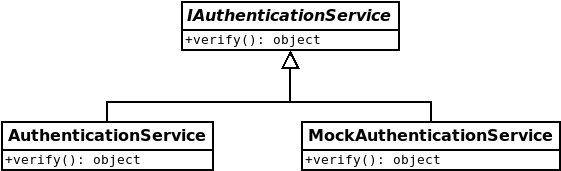

# Application services
Application services sit in the service layer, and act as a system for non-REST driven services that are not business logic, and therefore not part of the domain logic.

Helper services, such as authentication, are part of the application service layer.

They differ from middleware and API handlers because they do not get access to the request and response data.

Application services can be called from either middleware or API handlers. There may also be application services dealing with cross-cutting concerns being called by the event system, if an application service is registered as an event handler.

Application services can expose any number of public functions, as long as each implementation of the interface exposes *the same* public interface (see [mocks/README.md](../mocks/README.md) for mock exceptions). To create a new application service, an interface is placed into framework/application-services, name prefixed with `I` to allow name reuse. Ending the name with `Service` is only recommended in cases where the name might be shared with other types of interfaces.

### What is the difference between a `domain service` and `application service`?
The difference comes into how much knowledge it has about the problem domain. `Application services` are closer to the outside of the architecture, much like `API handlers` and `middleware`, and should have little to no domain expertise. That is to say, an `application service` should not directly alter the _system state_ (alter database records for example), for objects that are in the domain model. An `application service` is free to alter database records in, for example an invalidated token store (using the appropriate database interfaces), because a security token is not a _business concern_, and is not part of the Rätt Spår domain model. But an _application service_ must not be used to create or modify `Note` records. That would be the responsibility of `domain services` or `domain repositories`.

### How much work can I do in an `application service`?
As much work as is necessary to fulfill a _single responsibility_. If your `application service` does too many things, handles too many responsibilities, it would be good practice to extract them into more specialised `services`