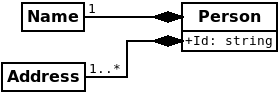

# Domain layer
The domain layer contains _business rules_, and is the layer that is supposed to make decisions surrounding domain _entities_.

The domain layer has been split into two separate pieces in Rätt Spår v4, the `domain` folder which contains the domain objects, and `domain services` which contains the domain services. Domain objects represent the **State** of the application, and it is objects (more specifically `aggregate roots`) that are persisted to the database (see `repository` below).

### Domain objects
Domain objects are the parts of the domain model that maps to specific resources, and processes that relate to those specific resources. There are three different types of domain objects, `entities`, `value objects` and `aggregate roots`.

`Entities` are objects that are identifiable by a specific, unique identifier field. An example would be
```
class Person {
  public Id: string;
  public Name: string;
  public Pockets: string[];
}
```
If two instances of `Person` have a matching `Id` field, they are considered equal (`a[Id] = b[Id] => true`).

`Value objects` are objects that are identifiable by their _value_. An example would be
```
class Address {
  public Street: string;
  public Number: string;
  public City: string;
}
```
If two instances of `Address` have _all fields match_, they are considered equal 

(`a[Street] = b[Street] ^ a[Number] = b[Number] ^ a[City] = b[City] => true`)

`Aggregate roots` are the entry points into an object graph, it is the part that represents a collection of `entities` and `value objects` as a logical whole.
`Aggregate roots` are always also entities, but not all entities have to be aggregate roots.

Example of an `aggregate root` is an extension of the above `Person` class:

```
class Person {
  public Id: string;
  public Name: Name;
  public Addresses: Address[]
}
```
Notice that `Person::Name` and `Person::Addresses` are instances of other classes, in this case `Value objects`. This marks `Person` as an `aggregate root`, since it is the entry point to an object graph (an `aggregate`).
The use of _composition_ over _aggregation_ in the object graph reveals these are value objects, not entities (Composition implies that the `Name` and `Addresses` instances cannot meaningfully exist without the `Person` instance).

An important aspect of `aggregate root` is that it is `aggregate roots` that should be exposed to the application. The parts that make up that aggregate should _not_ be.

### Domain services
See `domain services/README.md`

### Repositories
The `repository pattern` marks an important aspect of the domain model. The `repository pattern` suggests that the persistence of state is the responsibility of specialised services known as `repositories`, which exclusively deals with the problem of representing persisted state (database, files etc.) as if that state is always available. What this means is that the application can ask a `repository` for a specific object graph, and it is up to that repository to construct the graph and present it as a single logical entity, even if the constituent parts of that object graph is spread across multiple different collections in a MongoDb database.

Every type of `aggregate root` needs its own implementation of a `repository`, since every `aggregate root` will have its own specific needs for its persistence.

It is important to note that no other part of the software, including _the `aggregate root` itself_ should have any knowledge or make any assumptions on how the object is peristed.