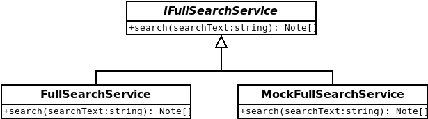

# Domain services
Domain services make up business rules and processes that do not fit into domain entities.

While `domain objects` make up the state of the application, `domain services` make up _stateless_ processes. That is to say, a `domain service` cannot be persisted, nor do domain services by themselves say anything about the system. `Domain services` sit at the domain layer, because unlike `application services` they are part of the business rules of Rätt Spår. An example of a `domain service` would be `FullSearch`, a process that would make a free-text search among journal notes on criteria spread among many different `domain objects`. In this example a single search-field could search not only `Notes` but also `Users`, `Drugtests`, `Checklists` and so on for matching results.

In this case, it probably wouldn't make sense to put this method on any one `domain object`, since many of them should not know of (depend on) each other.

However, the `INoteRepository` interface could logically have its own `SearchNotes` method that would search among the constituents of a `Note` – `Version`, `Author` and `Keywords` – since these are logically part of the `Note` object graph.

To create a domain service, a new abstract class should be created in `src/framework/domain-services`. This abstract class' public interface serves as the contract for the domain service, and decides what methods are valid for a consumer to call.

After that, mock and real implementations of the class are made. Mocks are only necessary if the service is complicated enough to make isolation testing of its consumers difficult without it.

### Do I need to make a `Domain service`?
Only when the process you want does not fit into _any_ stateful `domain object`. If the process depends on a specific object's state, and only that one object, it is probably more sensible to put that method directly on the `domain model` instead. Overuse of `domain services` will lead to what is called an _anemic domain model_, which means that we incur all the cost of maintaining a domain model but none of the gain. Most processes will fit on a `domain object` and when they do, that's where they should stay.

### What is the difference between a `domain service` and `application service`?
The difference comes into how much knowledge it has about the problem domain. `Application services` are closer to the outside of the architecture, much like `API handlers` and `middleware`, and should have little to no domain expertise. That is to say, an `application service` should not directly alter the _system state_ (alter database records for example), for objects that are in the domain model. An `application service` is free to alter database records in, for example an invalidated token store (using the appropriate database interfaces), because a security token is not a _business concern_, and is not part of the Rätt Spår domain model. But an _application service_ must not be used to create or modify `Note` records. That would be the responsibility of `domain services` or `domain repositories`.

### How much work can I do in a `domain service`?
As much work as is necessary to fulfill a _single responsibility_. If your `domain service` does too many things, handles too many responsibilities, it would be good practice to extract them into more specialised `services`